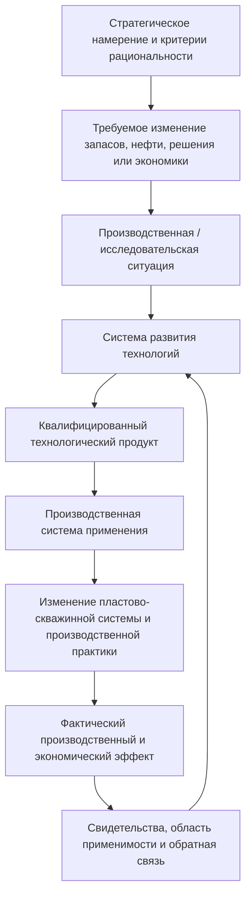

> **Статус в репозитории.** Это основной предметный источник для открытого архитектурного решения [PFAD-001](PFAD-001-petroleum-technology-development-framework-boundary.md). Он фиксирует рабочий синтез и кандидаты на архитектурные решения, но не выбирает между отдельным DPF, вкладом в другой DPF, нефреймворковым продуктом и отказом от нового поддерживаемого продукта. Отдельный `Petroleum Innovation DPF` пока является ведущей гипотезой, а не принятым решением. Документ также не является редакцией DPF или заменой полных тел паттернов.

# 1. Назначение документа

Этот документ отвечает на вопрос:

> Если нефть рассматривается как целевая система, а начальник отдела развития технологий управляет созданием работающих технологий, как правильно связать эти две позиции и не смешать нефть, технологию, проект, метод, способность, производственную систему и систему создания?

Главный вывод:

> **Нефть не исключается из модели. Она остаётся целевым объектом производственного эффекта и в принятом отраслевом представлении может называться операционной целевой системой эффекта. Непосредственным продуктом отдела являются квалифицированные технологии и методы. Системой, которой управляет начальник отдела, является контур создания, квалификации, передачи и развития этих технологий. Применяет их производственная система, а результат проверяется по изменению состояния запасов, нефти, производственных решений и экономики.**

При этом требуется важное уточнение языка:

- в обычном управленческом представлении допустимо говорить **«целевая система — нефть»**;
- в строгом FPF-анализе нельзя автоматически объявлять системой любой продукт, поток, материальную порцию, состояние или желаемый результат;
- выбор `project system-of-interest` зависит от конкретного проекта и решения;
- если текущим предметом является метод, способность, состояние, материальная порция, работа или описание, FPF рекомендует не превращать их искусственно в систему [S1; S2].

Поэтому в дальнейшем полезно различать два выражения:

1. **Целевой объект производственного эффекта — нефть и запасы.**
2. **Проектная система интереса — конкретная система, которую данный проект должен создать или изменить.**

Эти выражения могут указывать на разные объекты и не противоречат друг другу.

---

# 2. Короткий ответ на исходное сомнение

## 2.1. Нефть — целевая система или нет?

В рамках ранее построенного Petroleum Innovation DPF ответ был: **да, нефть — операционная целевая система эффекта**. Смысл решения состоял в том, чтобы не оптимизировать изолированно геологию, бурение, скважину, ППД, ГТМ или подготовку, а проверять их вклад в сквозное превращение запасов в полезный производственный результат [S6].

Эту управленческую идею следует сохранить.

Но формулировку нужно сделать точнее:

> **Нефть и запасы — главный целевой объект производственной ценности и эффекта.**

Называть ли нефть именно системой в строгом смысле, зависит от того, какой конкретный объект выделен и какая граница ему приписана:

- нефть вообще;
- определённая материальная порция;
- запасы конкретной залежи;
- поток продукции в производственной цепочке;
- партия товарной нефти;
- производственный актив, преобразующий ресурсную базу в товарную продукцию.

FPF не требует любой такой объект называть системой. Он требует сначала восстановить точный предмет утверждения и только затем, если это важно для решения, проверять его системность [S1, A.1.SCR; S2, SYSE.1].

Поэтому безопасная рабочая формулировка:

> **Верхним целевым объектом производственного эффекта для технологического развития являются нефть, запасы и создаваемый ими производственно-экономический результат.**

А формулировка «целевая система — нефть» остаётся полезной отраслевой моделью, если её границы и назначение определены и она не заставляет считать состояниями нефти состояния знания, проекта или решения.

## 2.2. Что тогда является «нашей системой» с позиции начальника отдела?

С позиции начальника отдела нужно различить:

- **что должно измениться во внешнем производственном мире**;
- **что создаёт отдел**;
- **кто создаёт этот продукт**;
- **кто применяет созданный продукт**;
- **на каком объекте возникает эффект**.

Рабочая схема:

```text
Система развития технологий
  создаёт / адаптирует / квалифицирует
        ↓
Технологический продукт
  передаётся и применяется
        ↓
Производственной системой
  воздействует на
        ↓
Пласт, скважины, потоки, запасы и нефть
  формируя
        ↓
Производственный и экономический результат
```

Следовательно:

- **непосредственным продуктом отдела** является не нефть, а работающий и квалифицированный способ;
- **управляемой системой отдела** является контур технологического развития;
- **системой применения** является производственная пластово-скважинная и наземная система;
- **целевой объект эффекта** — нефть, запасы и связанные с ними характеристики результата.

---

# 3. Базовые различения из FPF

Раздел не переносит язык FPF в корпоративную форму. Он фиксирует внутренние различения, необходимые для непротиворечивой предметной модели.

## 3.1. Project system-of-interest — роль относительно проекта

Текущая редакция Systems Engineering DPF использует выражение **project system-of-interest** как проектное обозначение системы, которую конкретный проект намерен изменить или создать. Это не отдельный универсальный вид систем и не постоянное свойство объекта [S2, SYSE.1].

Один и тот же комплекс деятельности может включать несколько проектов с разными системами интереса.

Пример:

| Проект | Возможная проектная система интереса |
|---|---|
| Разработка нового измерительного комплекса | Сам измерительный комплекс |
| Адаптация технологии закачки на активе | Контур применения технологии на конкретном участке |
| Перестройка работы отдела | Организационная система развития технологий |
| Изменение системы ППД | Система ППД соответствующего объекта |
| Создание цифровой платформы | Развёрнутая программно-организационная система |

При этом целевой производственный эффект всех этих проектов может в конечном счёте оцениваться через рациональное вовлечение запасов и изменение потока нефти.

## 3.2. Не всякий важный предмет является системой

FPF отдельно предостерегает от превращения в систему объектов другого типа. Если текущий вопрос относится к:

- методу;
- способности;
- состоянию;
- материальной порции;
- работе;
- описанию;
- коллекции;
- структуре;
- преобразованию,

то этот предмет следует сохранять под соответствующим типом, пока для решения не доказана необходимость системного прочтения [S2, SYSE.1:1–4].

Практическое следствие для нефтяной модели:

- «нефть локализована» может быть утверждением о состоянии знания и признанной оценке запасов;
- «исследования выполнены» — утверждением о работе;
- «технология готова» — утверждением о состоянии метода или технической системы;
- «ОПР завершён» — утверждением о проектной работе;
- «эффект доказан» — утверждением об использовании свидетельств для конкретного вывода;
- «Компания умеет применять метод» — утверждением о способности конкретного носителя.

Нельзя без потери смысла представить всё это как последовательные состояния одной нефти.

## 3.3. Метод, описание метода, план и выполненная работа — разные объекты

FPF различает [S1, A.3.1]:

| Объект | Смысл |
|---|---|
| **Метод** | Повторяемый способ действия в заданных условиях, с участниками, ожидаемым результатом и границами |
| **Описание метода** | Документ, модель, код, инструкция или иное представление метода |
| **План работ** | Намеченная будущая работа с датами, ресурсами и обязательствами |
| **Выполненная работа** | Фактически состоявшееся во времени действие конкретных исполнителей |

Для отдела развития технологий это означает:

> Описание технологии не является работающей технологией; наличие плана не означает выполнение; выполненный проект не означает готовность метода; отчёт ОПР не равен производственному эффекту.

Это различение уже присутствует в сводном каркасе DPF РНГМ и должно быть сохранено [S5].

## 3.4. Способность принадлежит конкретному носителю

В FPF способность — это ограниченная условиями способность конкретной системы-носителя выполнять класс работ или получать класс результатов в установленном диапазоне показателей и времени актуальности [S1, A.2.2].

Следовательно, выражение «не хватает технологической способности» требует уточнения:

- кому именно её не хватает;
- какой класс работ или результатов имеется в виду;
- в каких условиях;
- с какими показателями;
- на какой версии оборудования, ПО или организационной конфигурации;
- каким свидетельством подтверждается способность;
- до какого момента подтверждение актуально.

Возможные носители способности:

- отдельный инженер;
- команда;
- подразделение;
- подрядчик;
- лаборатория;
- производственный институт;
- программно-аппаратный комплекс;
- производственная система;
- социотехнический контур применения технологии.

Метод сам по себе не «обладает способностью». Метод описывает, **как действовать**. Способность отвечает, **может ли конкретный носитель выполнить этот метод и получить требуемый результат в заданных пределах**.

## 3.5. Результат исследования, испытания и модели имеет ограниченную силу

Systems Engineering DPF требует связывать результат исследования, модели, расчёта или испытания с конкретным инженерным утверждением и конкретным решением. Результат может:

- поддерживать утверждение;
- противоречить ему;
- сужать его;
- оставлять вопрос нерешённым [S2, SYSE.10].

Например:

- лабораторный тест подтверждает физико-химический механизм, но не полевую воспроизводимость;
- модель сравнивает сценарии внутри принятых допущений, но не доказывает поведение пласта;
- один ОПР подтверждает работоспособность одной версии технологии на одном объекте, но не универсальность;
- успешное повторное применение расширяет область поддерживаемого утверждения, но всё равно не делает технологию безусловной.

Отсюда следует, что готовность технологии нельзя свести к одному TRL или к факту положительного протокола.

---

# 4. Четыре ключевых объекта с позиции отдела развития технологий

## 4.1. Целевой объект производственного эффекта

Это то, ради изменения чего существует технологическое развитие:

- вовлечённые и извлекаемые запасы;
- состояние нефти и флюидов;
- доступ к запасам;
- приток и вытеснение;
- охват;
- дебит и устойчивость добычи;
- обводнённость;
- качество продукции;
- потери;
- расход воды, энергии и материалов;
- стоимость и время вовлечения;
- риск и HSE;
- производственно-экономический результат.

Именно здесь сохраняется смысл модели «нефть как целевая система эффекта».

Однако не каждое изменение, ведущее к этому результату, напрямую изменяет нефть. Для ГРР, диагностики и цифровых технологий непосредственным результатом может быть изменение знания или решения. Тогда причинная цепочка должна быть показана полностью:

```text
новые данные или метод
→ улучшенное описание объекта
→ изменённое инженерное решение
→ другое производственное действие
→ изменение пластово-скважинной системы
→ изменение извлечения и потока нефти
→ экономический эффект
```

## 4.2. Непосредственный продукт отдела

Продуктом работы отдела должен считаться не факт закрытия проекта, а **квалифицированный технологический продукт**.

Он может включать:

- повторяемый метод;
- техническую систему или устройство;
- состав или материал;
- программное средство;
- способ выбора объекта;
- способ проектирования воздействия;
- требования к исходным данным;
- правила выполнения;
- контрольные параметры;
- критерии остановки и корректировки;
- доказательства работоспособности и эффекта;
- установленную область применимости;
- требования к исполнителю и инфраструктуре;
- пакет передачи и тиражирования.

Коротко:

> **Технологический продукт отдела — это не только “что создано”, но и “как, кем, где, при каких условиях и с какой доказательностью это может воспроизводимо применяться”.**

## 4.3. Система создания и развития технологий

Это система, которой начальник отдела управляет непосредственно.

В неё могут входить:

- экспертный отдел;
- производственный институт;
- производственные подразделения;
- исполнители НИР и НИОКР;
- лаборатории и стенды;
- проектные команды;
- объекты и операторы ОПР;
- экспертные и gate-органы;
- экономический, патентный, закупочный и договорный контуры;
- владельцы данных;
- владельцы внедрения;
- информационные средства и реестры.

Её функция:

> **Регулярно преобразовывать значимые производственные и исследовательские ситуации в квалифицированные способы работы и обоснованные решения о применении, изменении, продолжении или остановке.**

Важное следствие:

- проекты являются временными работами внутри этой системы;
- технологии являются продуктами этой системы;
- реестр, платформа и документы являются описаниями и инструментами;
- число проектов не является главным результатом системы.

## 4.4. Производственная система применения

Квалифицированная технология не меняет нефть сама по себе. Её применяет конкретная производственная система:

- пласт;
- скважины;
- система ППД;
- фонд;
- оборудование;
- наземная инфраструктура;
- системы мониторинга;
- персонал;
- подрядчики;
- организационные правила эксплуатации.

Для каждого метода необходимо назвать:

- объект применения;
- выполняющую систему;
- условия;
- конфигурацию;
- ресурсы;
- границы безопасности;
- показатели результата;
- обратную связь.

## 4.5. Система внедрения и сопровождения

Между квалификацией и производственным применением часто существует отдельный разрыв. Поэтому полезно выделять контур внедрения:

- принятие технологии производственным владельцем;
- подготовка объектов;
- снабжение;
- сервис;
- обучение;
- регламенты;
- сопровождение первых применений;
- контроль качества;
- обновление метода;
- сбор отрицательных и пограничных кейсов.

Этот контур может быть частью системы развития технологий или производственной системы — это решается на уровне LPF конкретной компании. Но его нельзя считать автоматически существующим после положительного ОПР.

---

# 5. Является ли технология системой?

Слово «технология» используется в нефтяной практике слишком широко. Поэтому перед выбором проектной системы интереса нужно восстановить точный предмет.

## 5.1. Технология как метод

Примеры:

- метод выбора кандидатов на ГРП;
- метод управления профилем закачки;
- метод интерпретации ГДИ;
- метод расчёта воздействия;
- метод локализации остаточных запасов;
- метод принятия решений по режимам.

В таком случае технология является **методом**, а не системой.

Метод должен быть описан через:

- применимость;
- участников;
- входные условия;
- ожидаемый результат;
- необходимые отношения и ресурсы;
- показатели;
- ограничения;
- стоп-условия.

## 5.2. Технология как техническая система

Примеры:

- измерительный комплекс;
- оборудование заканчивания;
- насосная установка;
- система автоматического управления закачкой;
- скважинный инструмент;
- программно-аппаратная платформа.

Здесь технология может быть проектной системой интереса, если именно эту систему проект создаёт или изменяет.

## 5.3. Технология как социотехнический контур применения

Некоторые технологии существуют только как связка:

- материала или оборудования;
- метода выбора объекта;
- инженерного дизайна;
- действий персонала;
- мониторинга;
- снабжения;
- правил принятия решений;
- поддержки.

Например, технология выравнивания профиля вытеснения не исчерпывается гелем. Она может включать диагностику каналов, выбор участка, дизайн состава, приготовление, закачку, контроль отклика, корректировку режимов ППД и оценку эффекта.

В этом случае проектной системой интереса может стать **контур промышленного применения технологии**.

## 5.4. Технология как портфель или библиотека

«Совокупность работающих технологий Компании» — это портфель или репертуар. Наличие множества элементов ещё не делает его самостоятельной действующей системой.

Полезно различать:

- библиотеку квалифицированных методов;
- портфель технологических продуктов;
- систему управления этим портфелем;
- систему создания и обновления продуктов.

Только последние две позиции являются очевидными кандидатами на систему в организационном смысле.

## 5.5. Рабочий классификатор

| Формулировка «технологии» | Точный предмет | Что развивается | Возможная проектная система интереса |
|---|---|---|---|
| Метод выбора скважин | Метод | Логика, данные, критерии, границы | Не обязательно нужна; предметом может быть сам метод |
| Новый состав | Материал + метод применения | Рецептура и применение | Технический/социотехнический контур применения |
| Новый прибор | Техническая система | Архитектура и характеристики прибора | Прибор или измерительный комплекс |
| Алгоритм | Метод/ПО/описание — зависит от утверждения | Вычислительный способ и реализация | Развёрнутая программная система, если проект о ней |
| «Технология ГРП» | Семейство методов и систем | Дизайн, оборудование, материалы, применение | Конкретная версия технологического комплекса |
| Пакет тиражирования | Набор описаний и средств поддержки | Передаваемость и исполнение | Система применения, а не сам пакет документов |
| Портфель технологий | Коллекция и управленческое представление | Покрытие и баланс портфеля | Система управления портфелем, если она является предметом проекта |

---

# 6. Интегральная архитектура

## 6.1. Основная причинная цепочка



## 6.2. Различение «что», «чем», «кто» и «ради чего»

| Вопрос | Ответ |
|---|---|
| Что должно измениться? | Состояние запасов, нефти, производственной системы, качества знания или решения |
| Ради чего? | Рациональное вовлечение запасов и производственно-экономическая ценность |
| Что создаём? | Метод, техническую систему, состав, ПО или технологический комплекс |
| Кто создаёт? | Система развития технологий |
| Кто применяет? | Производственная или исследовательская система |
| Чем подтверждаем? | Связанным пакетом утверждений, аргументов, данных, испытаний и наблюдений |
| Кто принимает решение? | Уполномоченный владелец соответствующего gate-решения |
| Что тиражируется? | Не отчёт и не проект, а воспроизводимый способ с условиями и поддержкой |

## 6.3. Две разные петли результата

### Физическая технология

```text
технология
→ физическое воздействие
→ изменение пласта/скважины/потока
→ изменение добычи, воды, энергии и затрат
```

### Диагностическая, информационная или цифровая технология

```text
технология
→ новое описание или более качественное знание
→ изменённое решение
→ изменённое действие
→ изменение производственной системы
→ изменение добычи и экономики
```

Во втором случае нельзя приписывать технологии прямую дополнительную добычу, минуя решение и последующее вмешательство.

---

# 7. Как сохранить три конвейера и исправить их границы

Три конвейера остаются полезным управленческим представлением:

1. производственный результат;
2. технология;
3. проект.

Ошибка появляется, когда их превращают в одну онтологию и состояния разных объектов записывают как состояния нефти.

## 7.1. Конвейер производственного результата

Отвечает:

> Где и почему ресурсная база не превращается в требуемый производственный и экономический результат?

В нём целесообразно удерживать:

- физические состояния и потоки;
- готовность производственной системы выполнить переход;
- объём, время, качество, стоимость и риск;
- состояние вовлечения запасов как управленческий показатель.

Но необходимо маркировать, что именно изменилось:

- физический объект;
- знание;
- решение;
- работа;
- право или готовность к следующему действию.

## 7.2. Конвейер технологии

Отвечает:

> Насколько конкретная версия метода или технической системы способна дать требуемый результат в установленных условиях и воспроизводиться при повторении?

Его состояния могут включать:

```text
гипотеза
→ концепция механизма
→ расчётная/лабораторная проверка
→ прототип или опытный образец
→ готовность к объектовым испытаниям
→ полевая квалификация
→ установленная область применимости
→ готовность системы-носителя к исполнению
→ пакет внедрения
→ повторное применение
→ эксплуатационное улучшение версии
```

TRL является только одной характеристикой и не заменяет:

- доказанность эффекта;
- применимость;
- воспроизводимость;
- практическую ценность;
- HSE;
- готовность снабжения, сервиса и владельца.

## 7.3. Конвейер проекта

Отвечает:

> Какая ограниченная во времени работа организована для получения недостающего знания, метода, системы, доказательства или изменения практики?

Проект может:

- исследовать механизм;
- создавать техническое решение;
- адаптировать готовый метод;
- проверять применимость;
- формировать способность исполнителя;
- создавать контур внедрения.

Поэтому проект не должен иметь единый обязательный маршрут НИР → НИОКР → ОПР.

## 7.4. Необходимые дополнительные слои

Для РНГМ и особенно ГРР трёх конвейеров недостаточно как полной модели. Нужны отдельные слои:

1. **физическая реальность**;
2. **знание и неопределённость**;
3. **решения и ценность**;
4. **методы, технические системы и способности**;
5. **работы и проекты**.

Три конвейера становятся представлениями этого более полного графа, а не заменой графа.

---

# 8. Что такое технологический вызов в уточнённой модели

## 8.1. Почему нельзя начинать с ТВ

Исходным фактом может быть:

- производственный сигнал;
- неблагоприятное состояние;
- изменение внешних условий;
- неопределённость;
- новый класс запасов;
- перспективная технология;
- возможность радикально уменьшить стоимость или риск.

Но из этого ещё не следует необходимость развития технологии.

Ситуация может объясняться:

- ошибкой или недостатком данных;
- неустановленным механизмом;
- неприменением известного метода;
- отсутствием способности исполнителя;
- организационным разрывом;
- отсутствием финансирования или снабжения;
- недостатком доказательств применимости;
- экономической нецелесообразностью;
- реальной недостаточностью известных методов.

Только последний класс относится к технологическому вызову в строгом смысле.

## 8.2. Предлагаемое строгое определение

> **Технологический вызов — это ограниченное условиями и поддержанное достаточными основаниями утверждение о технологическом разрыве: для определённого класса объектов и принимаемого решения требуемый производственный либо информационно-решенческий результат не может быть надёжно обеспечен доступными и корректно применяемыми методами и техническими средствами в заданных ограничениях; поэтому требуется найти, создать или существенно изменить способ получения этого результата.**

Технологический вызов здесь:

- не физическая система;
- не технология;
- не проект;
- не симптом;
- не класс запасов;
- не название метода;
- не административный лозунг.

Он является **квалифицированным утверждением о несоответствии** между требуемым вкладом и возможностями существующих способов.

## 8.3. Проверочные условия признания ТВ

ТВ можно признать только когда:

1. Назван объект или класс объектов.
2. Названо решение, для которого требуется результат.
3. Определён требуемый результат и показатели приемлемости.
4. Зафиксированы условия, ограничения и горизонт.
5. Есть фактическая основа проблемы или обоснованная возможность.
6. Рассмотрены существующие способы, а не только одна привычная технология.
7. Недостаточность существующих способов имеет основания.
8. Разрыв не объясняется только данными, исполнением, организацией или внедрением.
9. Конкретное решение ещё не зафиксировано как единственно возможное.
10. Понятно, какое знание или изменение способа требуется получить следующим ходом.

## 8.4. Что не является ТВ

| Формулировка | Почему это не ТВ |
|---|---|
| «Карбонаты» | Класс геологического объекта |
| «Высоковязкая нефть» | Свойство флюида и класс условий |
| «Близкий ВНК» | Геологическое условие |
| «Высокая обводнённость» | Наблюдаемое состояние или симптом |
| «Конусообразование» | Возможный механизм |
| «МУН» | Класс методов |
| «ГРП» | Метод/семейство технологических решений |
| «Внедрение ПО» | Работа или решение, заранее выбранное без доказанной постановки |
| «Повышение эффективности разработки» | Слишком общая цель |
| «ОПР реагента» | Вид работы по проверке |
| «Нет тиражирования» | Возможный разрыв внедрения, способности или практической ценности |

## 8.5. Отношение ТВ и технологического разрыва

Полезно различать:

- **технологический разрыв** — диагностированное несоответствие;
- **технологический вызов** — принятая и коммуницируемая постановка этого разрыва на уровне класса объектов и результатов;
- **технологический заказ** — нейтральное к конкретному решению описание того, какой вклад должен обеспечить будущий способ.

Если такое различение не добавляет практической пользы, термин ТВ можно оставить только как короткое название кейса, а в данных хранить точные элементы разрыва.

---

# 9. Технологический заказ

## 9.1. Определение

> **Технологический заказ — принятое уполномоченным владельцем, нейтральное к конкретному решению описание требуемого вклада, условий, показателей, ограничений, доказательств и критериев остановки.**

Он отвечает на вопрос:

> Что должен обеспечивать будущий способ, чтобы его можно было рассматривать как подходящую альтернативу?

## 9.2. Минимальная структура заказа

```text
Технологический заказ

1. Класс объектов и контекст:
2. Решение, которое должен поддержать результат:
3. Требуемое изменение:
4. Показатели и диапазон приемлемости:
5. Защищаемые характеристики и ограничения:
6. Текущий способ и доказанное ограничение:
7. Условия применения:
8. Неприемлемые последствия:
9. Требуемая доказательность:
10. Предполагаемый масштаб и горизонт:
11. Критерии остановки или возврата:
12. Владелец следующего решения:
```

## 9.3. Заказ не должен быть скрытым ТЗ на выбранного исполнителя

Плохая формулировка:

> Разработать гель-полимерный состав марки X для месторождения Y.

Такая формулировка уже выбрала решение.

Более нейтральная формулировка:

> Обеспечить устойчивое снижение преимущественного движения закачиваемой воды по высокопроводящим каналам на установленном классе трещиноватых объектов при сохранении приемистости, HSE и положительной экономики; подтвердить влияние на вовлечение матрицы и определить область применимости.

После этого могут сравниваться:

- режимное управление ППД;
- потокоотклоняющие составы;
- пенные системы;
- селективная изоляция;
- изменение заканчивания;
- комбинированные решения;
- отказ от воздействия на части объектов.

---

# 10. Единица портфельного управления

Одна проблема, один ТВ и один проект не образуют устойчивую единицу портфеля.

Предлагаемый объект:

> **Кейс технологического развития** — связанное описание ситуации, решений, разрывов, вариантов работ, доказательств и последующих изменений практики.

## 10.1. Почему кейс устойчивее проекта

Кейс может:

- существовать до проекта;
- включать несколько проблемных формулировок;
- породить несколько проектов;
- пережить закрытие одного проекта;
- изменить диагноз после получения данных;
- перейти от НИР к поиску готового решения;
- завершиться решением не развивать технологию;
- быть возобновлён при изменении условий;
- связывать problem pull и opportunity push.

## 10.2. Структура кейса

| Блок | Содержание |
|---|---|
| Объект и решение | Что рассматривается и какое решение должно быть принято |
| Требуемый результат | Что должно измениться и по каким признакам это принимается |
| Фактическая основа | Данные, наблюдения, дата и область достоверности |
| Проблема/возможность | Материально различающиеся постановки |
| Значимость | Масштаб, последствия, стоимость бездействия, стратегическая опциональность |
| Механизм | Подтверждённые и конкурирующие причинные гипотезы |
| Неопределённость | Какой неизвестный факт способен изменить решение |
| Действующие способы | Методы, технические системы, результаты и ограничения |
| Способности носителей | Кто и в каких пределах способен выполнить способы |
| Диагноз разрыва | Знание, метод, доказательства, способность, внедрение или ценность |
| Технологический заказ | Требуемый вклад без выбора решения |
| Альтернативы | Готовые, адаптируемые, новые, организационные и вариант «не делать» |
| Следующая работа | Анализ, НИР, НИОКР, ОПР, производственная или организационная работа |
| Пакет доказательств | Утверждения, аргументы, данные, ограничения |
| Решение | Продолжить, изменить, остановить, применить ограниченно, тиражировать |
| Перенос и эффект | Область применения, повторение, фактический результат и остаточный разрыв |

---

# 11. Типы разрывов и выбор следующей работы

Главный операционный вопрос отдела должен звучать не «какой это ТВ?», а:

> **Какого результата сейчас не хватает и какой тип работы рационально выполнит следующий шаг?**

| Тип разрыва | Проверочный вопрос | Рациональный следующий ход | Строгий ТВ? |
|---|---|---|---:|
| Разрыв фактов и постановки | Есть ли достоверный объект, численный след, масштаб и решение? | Проверка данных, нормализация сигнала, дополнительный анализ | Нет |
| Разрыв знания о механизме | Понятно ли, почему возникает состояние и какой механизм существенен? | Диагностика, моделирование, НИР, различающий эксперимент | Нет |
| Разрыв метода/технического средства | Способны ли существующие и корректно применяемые способы обеспечить требуемый вклад? | Поиск, разработка или существенная адаптация способа | Да |
| Разрыв доказательств применимости | Существует ли метод, но доказана ли его работа в целевых условиях? | Квалификация, моделирование, лаборатория, ОПР | Нет |
| Разрыв способности носителя | Может ли конкретная система-исполнитель воспроизводимо выполнить метод? | Компетенции, оснащение, доступ, сервис, провайдер | Нет |
| Разрыв внедрения | Квалифицирован ли метод, но не встроен ли он в производство? | Владелец, регламент, снабжение, обучение, сопровождение | Нет |
| Разрыв практической ценности | Стоит ли способ затрат, времени, риска и системных последствий? | Сравнение альтернатив, сужение, отсрочка или отказ | Нет |
| Разрыва развития нет | Есть ли готовый и доступный штатный способ? | Производственное мероприятие | Нет |

## 11.1. Связь с видами работ

| Недостающий результат | Типовой вид работы |
|---|---|
| Достоверное описание состояния | Исследование, сбор и верификация данных |
| Причинное знание | НИР, диагностика, моделирование, эксперимент |
| Новый или существенно изменённый способ | НИОКР/ОКР, разработка метода или технической системы |
| Готовое решение из внешнего рынка | Поиск, квалификация, закупка, адаптация |
| Полевое доказательство | ОПР/ОПИ |
| Умение конкретного носителя выполнять метод | Обучение, оснащение, сервис, организационное развитие |
| Фактическое использование | Внедрение, изменение регламента, операционное сопровождение |
| Известный способ на известном объекте | Обычное производственное мероприятие |

НИР, НИОКР и ОПР не являются обязательной последовательной лестницей. Они выбираются по характеру недостающего результата [S5; S7].

---

# 12. Результат проекта, технологии, системы создания и производства

## 12.1. Результат проекта

Проект может дать:

- данные;
- расчёт;
- модель;
- объяснение;
- опровергнутую гипотезу;
- прототип;
- состав;
- ПО;
- методику;
- опытный образец;
- результаты испытания;
- пакет доказательств;
- решение.

Корректно выполненный проект может завершиться выводом, что технология не работает или нецелесообразна. Это не обязательно неуспех проекта.

## 12.2. Результат технологии

Технология при применении может изменить:

- фильтрационный поток;
- охват;
- подвижность;
- приемистость;
- продуктивность;
- обводнённость;
- надёжность;
- качество знания;
- точность решения;
- время цикла;
- стоимость;
- производственный риск.

## 12.3. Результат системы развития технологий

Система развития технологий должна оцениваться по способности:

- правильно различать ситуации;
- выбирать подходящий следующий тип работы;
- удерживать альтернативы;
- получать решающие доказательства;
- сокращать время от ситуации до решения;
- сохранять отрицательные знания;
- выпускать квалифицированные технологические продукты;
- обеспечивать передачу и повторное применение;
- обновлять область применимости по факту эксплуатации.

Количество проектов, НИР или ОПР — только показатели нагрузки, но не конечный результат.

## 12.4. Производственный результат

Конечная проверка включает:

- фактическое применение;
- изменение относительно исходной линии;
- причинную атрибуцию;
- устойчивость;
- системные побочные эффекты;
- экономику;
- размер фактической области использования;
- остаточный разрыв.

---

# 13. Когда считать технологический вызов снятым

Статус `ТВ закрыт` слишком груб. Следует независимо отслеживать состояния нескольких объектов.

| Объект | Возможные состояния результата |
|---|---|
| Проблемная постановка | Подтверждена, уточнена, опровергнута, потеряла актуальность |
| Причинная гипотеза | Поддержана, сужена, противоречит данным, нерешена |
| Технологический разрыв | Подтверждён, не подтверждён, частично устранён, устранён |
| Метод/техническая система | Создан, адаптирован, работоспособен, квалифицирован, отклонён |
| Доказательства | Поддерживают, противоречат, сужают или не разрешают утверждение |
| Способность носителя | Создана, подтверждена в диапазоне, утрачена, требует обновления |
| Проект | Выполнен, изменён, остановлен, не выполнен |
| Внедрение | Решение принято, пакет подготовлен, применение начато, повторение подтверждено |
| Производственный разрыв | Уменьшен, не изменился, перераспределён, дальнейшее закрытие нерационально |

В узком смысле ТВ снимается, когда:

> **Для установленного класса объектов и условий существует квалифицированный и доступный способ, способный обеспечить требуемый вклад.**

Но это ещё не означает:

- что Компания умеет его применять;
- что он встроен в практику;
- что его применение экономически лучше всех альтернатив;
- что исходная производственная проблема полностью устранена;
- что эффект подтверждён на всём целевом фонде.

---

# 14. Семь типов связанности

В ранее подготовленной модели уже есть пять сильных связей [S5]:

1. проблемная;
2. функциональная;
3. проектная;
4. доказательная;
5. связанность переноса.

Для полной архитектуры следует добавить ещё две.

## 14.1. Проблемная связанность

> Какая подтверждённая проблема или обоснованная возможность является основанием работы?

## 14.2. Функциональная связанность

> За счёт какого механизма кандидат решения должен изменить причину или обеспечить требуемый вклад?

## 14.3. Проектная связанность

> Какую версию технологии, какой результат и какую неопределённость снимает конкретный проект?

## 14.4. Доказательная связанность

> Какие свидетельства поддерживают какое утверждение, в каких условиях и до какой границы?

## 14.5. Связанность переноса

> Что должно сохраниться при повторении, чтобы результат был ожидаемым на другом объекте?

## 14.6. Решенческая связанность

> Какое конкретное инженерное или управленческое решение изменится благодаря полученному результату?

Она особенно важна для ГРР, диагностики, моделей, ПО и локализации остаточных запасов.

## 14.7. Связанность исполнения

> Какая система-носитель способна воспроизводимо выполнять метод в заданных условиях и при какой поддержке?

Она защищает от подмен:

- инструкция = способность;
- обучение = доказанная способность;
- поставщик существует = поставка доступна;
- решение о внедрении = фактическое применение;
- успешный пилот = воспроизводимый промышленный метод.

---

# 15. Проверка на двух типовых кейсах

## 15.1. РНГМ: ранний прорыв воды в трещиноватом карбонате

### Целевой производственный эффект

- повысить вовлечение матрицы;
- снизить непродуктивную циркуляцию воды;
- сохранить приемистость и управляемость ППД;
- получить положительный системный экономический результат.

### Фактическая ситуация

- ранняя вода;
- рост обводнённости;
- неравномерность отклика добывающих скважин;
- возможная связь с высокопроводящими трещинами.

### Конкурирующие постановки

- каналирование по трещинам;
- конусообразование;
- неверный режим депрессии;
- неудачное заканчивание;
- межпластовый переток;
- недостаточная наблюдаемость;
- ошибка модели связанности.

### Что нельзя делать сразу

Нельзя сразу записывать ТВ как «разработка гель-полимерного состава». Это преждевременный выбор решения.

### Возможная последовательность

```text
сигнал ранней воды
→ проверка данных и локализация источника
→ сравнение причинных гипотез
→ диагностическая работа
→ установленный или достаточно поддержанный механизм
→ анализ штатных методов
→ подтверждение технологического разрыва
→ технологический заказ
→ сравнение режимных, химических, механических и комбинированных способов
→ НИР/НИОКР/ОПР по характеру отсутствующего результата
→ пакет доказательств
→ квалификация области применения
→ передача производственной системе
→ повторное применение и оценка эффекта
```

### Объекты модели

| Позиция | Объект |
|---|---|
| Целевой объект эффекта | Запасы матрицы, поток нефти и воды, производственная экономика |
| Производственная система | Пласт, нагнетательные и добывающие скважины, ППД, наземка, персонал |
| Технологический продукт | Метод диагностики + способ управления потоками + правила применения |
| Система создания | Отдел, ПИ, лаборатория, исполнитель, полигон, эксперты |
| Проектная система интереса | Зависит от проекта: состав, оборудование или контур применения |
| Доказательства | Исходная линия, трассировка механизма, отклик, сравнение, устойчивость и перенос |

## 15.2. ГРР: низкая точность локализации перспективного объекта

### Целевой результат

Непосредственный результат — не физическое изменение нефти, а повышение качества решения о бурении, доразведке или отказе.

### Причинная цепочка

```text
новый метод наблюдения или интерпретации
→ более качественное описание геологического объекта
→ изменение распределения неопределённости
→ другое решение о бурении или доразведке
→ подтверждение или отказ от объекта
→ изменение вовлечённой ресурсной базы
→ будущая добыча и экономический результат
```

### Возможные разрывы

- данных недостаточно;
- данные есть, но метод обработки слаб;
- модель не различает существенные сценарии;
- текущая точность достаточна, но решение всё равно экономически неустойчиво;
- метод существует на рынке, но не квалифицирован в условиях Компании;
- метод квалифицирован, но нет способности его применять;
- проблема решается дополнительной съёмкой без нового технологического развития.

### Когда появляется строгий ТВ

Только если установлено:

- какая точность нужна для конкретного решения;
- какова текущая точность и цена ошибки;
- почему доступные и корректно применяемые методы не обеспечивают требуемого результата;
- какое изменение способа действительно необходимо.

### Объекты модели

| Позиция | Объект |
|---|---|
| Верхний целевой объект ценности | Рациональное решение о ресурсной базе и последующее вовлечение запасов |
| Непосредственный результат технологии | Данные, интерпретация, модель или снижение неопределённости |
| Система применения | Контур наблюдения, обработки, интерпретации и принятия решений |
| Технологический продукт | Метод и/или измерительно-программная система |
| Система создания | Отдел, ГРР, ПИ, исполнитель, полигон/эталонные объекты |
| Доказательства | Слепые проверки, прогноз до факта, точность, калибровка, перенос и влияние на решение |

Этот кейс показывает, почему нефть может оставаться верхним целевым объектом ценности, но не быть непосредственным изменяемым объектом каждой технологии.

---

# 16. Роль начальника отдела развития технологий

С позиции руководителя объект управления — не отдельная технология и не единичный проект, а **способность всей системы развития технологий регулярно получать квалифицированные технологические продукты**.

## 16.1. Основные управленческие задачи

1. **Определять границу кейса.**
   - Какой объект и решение рассматриваются?
   - Каков горизонт?
   - Что является фактом, а что интерпретацией?

2. **Обеспечивать качество постановки.**
   - Не принимать симптом за механизм.
   - Не принимать класс объектов за проблему.
   - Не принимать заранее выбранную технологию за ТВ.

3. **Маршрутизировать по типу разрыва.**
   - Данные?
   - Знание?
   - Метод?
   - Доказательство?
   - Способность?
   - Внедрение?
   - Практическая ценность?

4. **Удерживать пространство альтернатив.**
   - Готовое решение.
   - Адаптация.
   - Собственная разработка.
   - Комбинация.
   - Организационное действие.
   - Отсрочка или отказ.

5. **Назначать правильный тип работы.**
   - Анализ.
   - НИР.
   - НИОКР.
   - ОПР.
   - Производственное мероприятие.
   - Организационное изменение.

6. **Требовать доказательную связность.**
   - Какое утверждение проверяется?
   - Какой результат его поддержит или опровергнет?
   - Где граница переноса?

7. **Отделять результат проекта от результата технологии.**

8. **Не допускать завершения на отчёте.**
   - Нужны применимость, способность исполнителя, передача и повторение.

9. **Управлять портфелем как картой разрывов и способов.**
   - Где нет покрытия?
   - Где есть только гипотеза?
   - Где метод доказан, но не внедрён?
   - Где технология есть, но стала неактуальна?

10. **Обновлять репертуар технологий и отрицательных знаний.**

## 16.2. Что не должно быть главным KPI отдела

- количество инициатив;
- количество ТВ;
- количество НИР;
- количество ОПР;
- доля проектов, закрытых по сроку;
- число положительных протоколов.

## 16.3. Более содержательные показатели

- доля ситуаций, правильно маршрутизированных без ненужного НИОКР;
- время от подтверждённой ситуации до обоснованного следующего решения;
- доля технологических продуктов с установленной областью применимости;
- доля продуктов, переданных владельцу и повторно применённых;
- качество прогнозирования эффекта и границ;
- снижение повторения ранее выявленных ошибок;
- доля отрицательных результатов, превратившихся в используемое знание;
- покрытие приоритетных классов разрывов квалифицированными способами;
- фактический производственно-экономический эффект с оговорённой причинностью.

---

# 17. Рекомендуемая корпоративная терминология

Для инженеров и руководителей не требуется переносить внутреннюю терминологию FPF. Достаточно следующего набора.

| Рекомендуемый термин | Рабочий смысл |
|---|---|
| **Целевой производственный результат** | Какое изменение запасов, добычи, качества, времени, стоимости или риска требуется |
| **Объект и условия** | Где и в каком контексте результат должен быть получен |
| **Проблема / возможность** | Что не устраивает сейчас или какой новый результат стал потенциально достижим |
| **Причинная гипотеза** | Почему возникает ситуация и что может её изменить |
| **Неопределённость** | Какой неизвестный факт способен изменить решение |
| **Действующий способ** | Как задача решается сейчас |
| **Ограничение способа** | Почему текущий способ не обеспечивает требуемый результат |
| **Технологический разрыв** | Подтверждённое несоответствие между требуемым вкладом и существующими способами |
| **Технологический вызов** | Принятая формулировка существенного технологического разрыва для класса объектов; термин необязателен |
| **Технологический заказ** | Что должен обеспечить будущий способ без выбора конкретного решения |
| **Кандидаты решений** | Альтернативные способы выполнения заказа |
| **Технологический продукт** | Метод/система/комплекс вместе с применимостью, доказательствами и пакетом исполнения |
| **Проект / работа** | Ограниченная деятельность по получению конкретного недостающего результата |
| **Область применимости** | Условия, в которых пакет доказательств поддерживает ожидаемый результат |
| **Владелец внедрения** | Производственный владелец фактического применения и поддержания способа |
| **Подтверждённый эффект** | Изменение относительно базы с оценкой причинности, устойчивости и масштаба |

## 17.1. Как употреблять выражение «целевая система»

Рекомендуется три уровня языка.

### Для управленческой коммуникации

> **Целевая система эффекта — нефть и её путь от ресурсной базы до товарного результата.**

Допустимо как наглядная рамка.

### Для предметного DPF

> **Целевой объект производственного эффекта — нефть, запасы и их производственно значимые состояния; производственные системы обеспечивают и изменяют соответствующие переходы.**

Точнее и устойчивее.

### Для конкретного проекта

> **Проектная система интереса выбирается отдельно для данного решения и может быть технической, производственной, социотехнической или организационной системой.**

---

# 18. Что следует изменить в текущем Petroleum Innovation DPF

## 18.1. Сохранить

- нефть как сквозной целевой объект производственной ценности;
- три разных конвейера;
- различение проекта и технологии;
- технологический заказ;
- пять типов связанности;
- квалификацию применимости;
- пакет метода;
- различение результата проекта и результата технологии;
- решение по следующему ходу вместо бинарного успеха.

## 18.2. Уточнить

### Формулировку о целевой системе

Сейчас пакет утверждает «нефть — целевая система» и связывает это решение со старой интерпретацией ссылки на `A.2.1` [S6]. В загруженной текущей редакции FPF `A.2.1` посвящён назначению системы на контекстную роль, а проектная система интереса раскрывается отдельно в `A.1.SCR` и `SYSE.1` [S1; S2].

Следовательно, rationale необходимо повторно проверить:

- обновить ссылку на FPF;
- не представлять выбор нефти как обязательное требование FPF;
- зафиксировать его как предметное решение нефтяного DPF;
- определить, в каких рассмотрениях нефть выступает системой, материальным потоком, ресурсом, состоянием или объектом ценности.

### Состояния конвейера нефти

Нужно разделить:

- физические состояния нефти и продукции;
- состояния знания о запасах;
- статусы решения;
- готовность производственной системы;
- выполненные работы.

Например:

| Текущая формулировка | Более точное разнесение |
|---|---|
| Нефть исследована | Проведена исследовательская работа; получены данные; обновлено описание объекта |
| Нефть локализована | Запасы локализованы в принятой модели с установленной уверенностью для решения |
| Нефть запланирована | Принято решение/план по вовлечению определённого объёма |
| Открыт доступ | Производственная система физически обеспечивает доступ к объекту |
| Поднята | Продукция физически поступила на поверхность |

### ГРР и enabling-технологии

Добавить явный решенческий путь:

```text
технология наблюдения/описания
→ знание
→ решение
→ действие
→ производственный эффект
```

### Технологический вызов

Сделать ТВ либо:

1. строгим утверждением о подтверждённом разрыве метода/технического средства; либо
2. коммуникационным заголовком поверх точной структуры кейса.

### Дополнительные связи

Добавить решенческую связанность и связанность исполнения.

## 18.3. Не переносить в DPF

- конкретные подразделения;
- корпоративные комитеты;
- названия систем;
- формы и сроки;
- числовые пороги KPI;
- маршруты бюджета и договора.

Это остаётся в LPF Компании.

---

# 19. Рекомендуемая итоговая модель


Модель не является обязательным линейным процессом. Возвраты и параллельная работа допустимы. Например:

- данные могут изменить проблемную постановку;
- найденная технология может изменить представление о достижимом результате;
- ОПР может сузить область применимости;
- экономика может остановить технически успешное направление;
- промышленное применение может потребовать новой версии метода.

---

# 20. Управленческая формулировка на одну страницу

## Что является целью

Рационально изменять состояние ресурсной базы, запасов и нефти, обеспечивая требуемый производственный и экономический результат с учётом времени, стоимости, воды, энергии, инфраструктуры, HSE, риска и неопределённости.

## Что создаёт отдел

Не проекты и отчёты, а **квалифицированные способы работы**:

- методы;
- технологии;
- технические системы;
- программные средства;
- правила применения;
- доказательства;
- области применимости;
- пакеты передачи и тиражирования.

## Какой системой управляет начальник отдела

Системой развития технологий, которая связывает:

```text
ситуацию
→ правильную постановку
→ диагноз разрыва
→ альтернативы
→ подходящую работу
→ доказательства
→ решение
→ квалифицированный продукт
→ внедрение
→ обратную связь
```

## Где применяется результат

В производственной или исследовательской системе:

- пласт;
- скважины;
- ППД;
- фонд;
- инфраструктура;
- контур исследований и интерпретации;
- персонал и подрядчики.

## Что такое технологический вызов

Не любая проблема и не название технологии, а доказанное несоответствие между требуемым результатом и возможностями существующих методов и технических средств.

## Что считать конечным результатом

Не завершение проекта и не положительный ОПР, а:

- квалифицированный способ;
- установленная область применимости;
- подтверждённая способность исполнителя;
- принятое и реализованное производственное применение;
- повторяемый эффект;
- обновлённое знание о границах и остаточном разрыве.

---

# 21. Чек-лист для нового кейса

До признания технологического вызова ответить:

1. Какой реальный объект рассматривается?
2. Какое решение должно быть принято?
3. Какой производственный или информационно-решенческий результат требуется?
4. Каков горизонт?
5. Каковы критерии рациональности?
6. Что фактически наблюдается?
7. Каково качество данных?
8. Что является симптомом, а что подтверждённой проблемой?
9. Какие материально различающиеся постановки возможны?
10. Какие причинные механизмы конкурируют?
11. Что может опровергнуть каждую гипотезу?
12. Как задача решается сейчас?
13. Какие существующие методы и технические средства доступны?
14. Применялись ли они корректно?
15. Что именно в них ограничивает результат?
16. Не является ли разрыв проблемой данных, исполнения, способности или внедрения?
17. Есть ли основания признать технологический разрыв?
18. Какой вклад должен обеспечить будущий способ?
19. Какие альтернативы существуют, включая «не делать» и «отложить»?
20. Какой следующий вид работы создаст недостающий результат?
21. Какое утверждение будет проверяться?
22. Какой пакет доказательств нужен для решения?
23. Какая система-носитель должна уметь выполнять метод?
24. Кто является владельцем внедрения?
25. Как будет проверяться повторное применение?
26. Что будет основанием остановить работу?

---

# 22. Открытые вопросы для проверки на реальных кейсах

1. В каких задачах РНГМ выражение «нефть как целевая система» действительно помогает принять лучшее решение, а в каких достаточно «целевого объекта эффекта»?
2. Как определить границу нефти или потока продукции, если требуется строгое признание системы?
3. Какую проектную систему интереса выбирать для технологии, являющейся прежде всего методом?
4. Когда контур применения технологии следует считать отдельной социотехнической системой?
5. Достаточно ли термина «технологический разрыв», чтобы отказаться от ТВ как отдельной сущности?
6. Как отличать область применимости метода от способности конкретного исполнителя?
7. Как формально связывать enabling-технологии ГРР и диагностики с последующим изменением решения?
8. Какая единица портфельного управления удобнее на практике: кейс развития способа, технологический заказ или проблемное поле?
9. Как учитывать технологии, одновременно влияющие на несколько проблем и решений?
10. Какой минимальный пакет доказательств требуется для перехода от ОПР к ограниченному применению и затем к тиражированию?

Проверку рекомендуется провести минимум на трёх сквозных кейсах:

- физическая технология РНГМ;
- технология ГРР или диагностики, изменяющая знание и решение;
- положительный ОПР без состоявшегося тиражирования.

---

# 23. Источники и статус положений

## 23.1. Основные источники

**[S1] FPF Core**  
Файл: `FPF-main/FPF-Spec.md`  
Использованные положения:

- `A.1.SCR:4.7` — project system-of-interest как проектное обозначение;
- `A.1.SCR:4.8` — система не тождественна роли, способности, работе, методу, плану, доказательству или описанию;
- `A.2.1` — контекстное назначение системы на роль;
- `A.2.2` — способность конкретного носителя в заданном диапазоне;
- `A.3.1` — метод как повторяемый способ и различение метода, описания, плана и работы.

**[S2] Systems Engineering Principles Framework**  
Файл: `FPF-main/Engineering DPF Suite/SYSTEMS-ENGINEERING-PRINCIPLES-FRAMEWORK.md`  
Использованные положения:

- `SYSE.1` — выбор и пересмотр project system-of-interest;
- `SYSE.10` — ограниченная сила результатов исследований, моделей и испытаний для инженерного решения;
- `SYSE.22` — совместная эволюция проблем и вариантов системных решений.

**[S3] Method Engineering Principles Framework**  
Файл: `FPF-main/Engineering DPF Suite/METHOD-ENGINEERING-PRINCIPLES-FRAMEWORK.md`  
Использованные положения:

- `ME.3` — ситуационные требования и критерии пригодности метода;
- `ME.13` — проверка пригодности и переноса;
- `ME.14` — практическая ценность относительно актуальных альтернатив;
- различение метода, его описания, плана и фактической работы.

**[S4] Problem Structuring and Decision Support Principles Framework**  
Файл: `FPF-main/Engineering DPF Suite/PROBLEM-STRUCTURING-AND-DECISION-SUPPORT-PRINCIPLES-FRAMEWORK.md`  
Использованные положения:

- `PSD.3` — несколько материально различающихся проблемных постановок;
- `PSD.8` — генерация полноценных альтернатив до выбора;
- `PSD.10` — явное представление неопределённости и границ доказательств;
- `Construct a Bounded Development Opportunity` — работа с возможностью до появления определённого решения.

**[S5] DPF РНГМ, модуль «Развитие и испытание технологий», сводный каркас**  
Файл: `DPF_РНГМ_модуль_развития_технологий_сводный_каркас.md`  
Использованные положения:

- различения проблемы, ТВ, технологического заказа, метода, технологии, проекта, доказательства, внедрения и тиражирования;
- три конвейера;
- пять типов связанности;
- выбор между НИР, НИОКР, ОПР и производственным мероприятием;
- профиль квалификации и область применимости.

**[S6] Petroleum Innovation + DS-system-BV-TV, полный пакет**  
Файл: `2026-07-30-petroleum-innovation-bvtv-fpf-FULL.md`  
Использованные положения:

- Primary Entity of Concern — нефтяная инновация;
- операционная целевая система эффекта — нефть;
- DRR о выборе нефти вместо пласта;
- различение ГДИ как метода и контура ГДИ как системы;
- система-создатель и конвейер развития технологий;
- модель трёх конвейеров.

**[S7] Контекст переосмысления технологических вызовов РНГМ и ГРР**  
Файл: `Контекст_переосмысление_технологических_вызовов_РНГМ_ГРР.md`  
Использованные положения:

- критика смешения физических, эпистемических, решенческих и проектных состояний;
- эволюция понятия ТВ;
- диагностическая цепочка «симптом → объект → параметр → механизм → ограничение метода → требуемая функция»;
- problem pull и opportunity push;
- особенности ГРР;
- типы ситуаций, ошибочно объединяемых под ТВ.

## 23.2. Что является прямым следствием источников

К источниковым положениям относятся:

- необходимость различать систему, метод, способность, работу, описание и доказательство;
- проектная относительность system-of-interest;
- holder-specific характер способности;
- ограниченная сила результатов модели и испытаний;
- необходимость удерживать альтернативные постановки и решения;
- различение проекта, технологии и производственного эффекта;
- три конвейера и технологический заказ в ранее подготовленных материалах.

## 23.3. Что является предлагаемым синтезом

Следующие положения являются рабочими предложениями данного документа и требуют проверки на реальных кейсах:

- формулировка «целевой объект производственного эффекта» как более устойчивое выражение;
- модель четырёх ключевых объектов: эффект, продукт, система создания, система применения;
- выделение системы внедрения;
- строгое определение технологического вызова как квалифицированного утверждения о разрыве метода/технического средства;
- понятие кейса технологического развития как единицы портфельного управления;
- классификация семи типов разрывов;
- добавление решенческой связанности и связанности исполнения;
- предлагаемая итоговая архитектура DPF/LPF.

---

# 24. Итог

Выбор нефти как верхнего целевого объекта был полезным: он вернул технологическое развитие к производственной ценности и не позволил считать локальную активность подразделений конечным результатом.

Но для зрелой модели необходимо развести:

```text
нефть и запасы — ради чего требуется эффект;
производственная система — где и кем применяется способ;
технология/метод — что создаётся и передаётся;
система развития технологий — кто и как создаёт способ;
проект — какая временная работа получает недостающий результат;
доказательства — что поддерживает конкретное утверждение;
внедрение — как способ становится реальной практикой.
```

Главная формулировка:

> **Начальник отдела развития технологий управляет не нефтью непосредственно и не перечнем проектов. Он управляет системой, которая должна создавать, квалифицировать и передавать производству новые воспроизводимые способы рационального изменения состояния запасов, нефти, качества решений и производственно-экономического результата.**

Именно на границе между требуемым изменением и возможностями существующих способов появляется технологический вызов — если доказано, что проблема действительно технологическая, а не информационная, исполнительская, организационная, внедренческая или экономическая.
